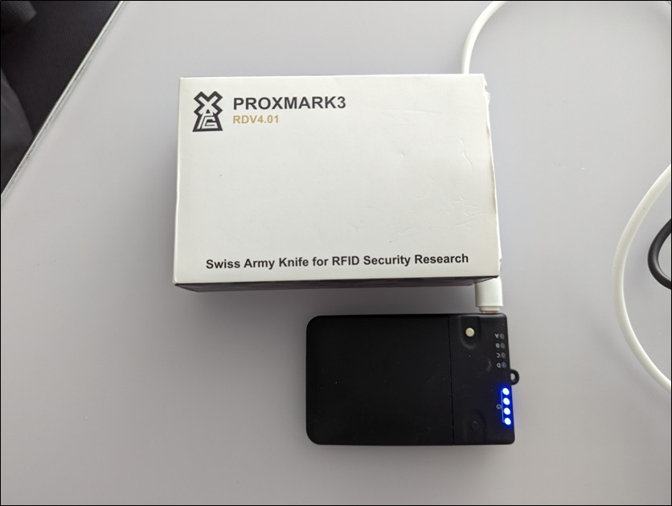
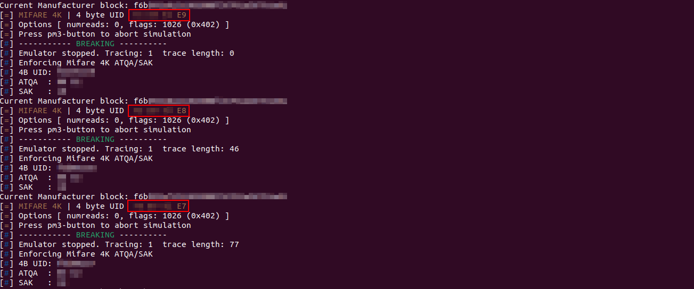

# Proxmark3 MIFARE UID Fuzzer

Lua script for the Proxmark3 client that **fuzzes MIFARE Classic UIDs** in order to assess the robustness of UID-based access control systems.

> **Status note**  
> This is a refactored version of a script that was originally developed and tested in 2022 during an access-control assessment; only the code structure and readability have been revised, so it may require minor adjustments for newer Proxmark3 firmware / client versions.

---

## Overview

Many access control systems still rely only on the **UID (card serial number)** of MIFARE Classic badges to grant or deny access.  
This repository contains a Lua script that automates Proxmark3 commands to:

- emulates a MIFARE Classic 4K card,
- vary the UID according to different strategies,
- and sends a sequence of candidate UIDs to a reader in order to verify whether **other UIDs can be found that unlock the system**.

During the original engagement, the goal was to verify that:

- even with high-speed UID fuzzing,
- and with different search strategies around a known valid UID,

no alternative valid UID could be discovered on the tested readers, and to observe what alarms, if any, were triggered by this unusual behavior.

---

## Features

The script supports three main fuzzing strategies (plus a random mode) based on the manufacturer block / UID:

1. **Pseudo-random within a range**

   - Given a reference UID, generate pseudo-random UIDs within a configurable range around it.

2. **Incremental search**

   - Given a starting UID, increment it by a configurable step `X` and emulate each resulting UID.

3. **Decremental search**

   - Given a starting UID, decrement it by a configurable step `X` and emulate each resulting UID.

Internally the script:

- works on the manufacturer block of the tag,
- converts UIDs between hex strings and integers,
- and calls the Proxmark3 client command:

```text
hf mf sim --4k -u <UID>
```

to emulate a MIFARE Classic 4K card with the chosen UID.

---

## Getting started

### 1. Requirements

- **Hardware**
  - Proxmark3 (tested on **RDV4.01** board).
- **Software**
  - Proxmark3 firmware and client with **Lua scripting support** enabled.
  - A working build of the `pm3` client on your machine.



---

### 2. Running the script with the pm3 client

1. **Configure the manufacturer blocks in the script**  
   Open `mifare-uid-fuzzer.lua` and set the two manufacturer block variables to values that match (or are close to) the cards you want to emulate.

   ```lua
   -- Example manufacturer blocks (replace with your own)
   local cur_man_block_1 = "a3b4912f221104008c5577125e900101"
   local cur_man_block_2 = "7f01c2ab3310020077aa44dd88990102"
   ```

   These 16‑byte (32 hex character) values represent the content of the MIFARE Classic manufacturer block, including UID, BCC, and other bytes.

2. **Adjust the fuzzing parameters**  
   In the same file, review and tune the main configuration variables:

   ```lua
   local tag_id  = 2746519855       -- starting UID (integer form)
   local counter = 30               -- how many UIDs to emulate
   local step    = 1                -- increment / decrement step
   local choice  = 3                -- strategy selector
   ```

   - `choice` selects the **strategy** (pseudo‑random (1) / incremental (2) / decremental (3)).  
   - `step` controls how much the UID changes between one attempt and the next.  
   - `counter` controls how many UIDs are tested in a single run.  
   - `tag_id` is the starting UID to be used.  

   At the end of the main loop you will also find a call like:

   ```lua
   os.execute('sleep 2')
   ```

   which defines the delay in seconds between one emulated UID and the next. Increase this value for slower readers, or decrease it for readers that accept faster cycles.

3. Connect the Proxmark3 to your machine and start the client:

   ```bash
   pm3
   ```

4. From within the Proxmark3 client, run the script (adjust the path if needed):

   ```text
   script run mifare-uid-fuzzer.lua
   ```

   Depending on your client version, you can also use:

   ```text
   lua mifare-uid-fuzzer.lua
   ```

5. Place the Proxmark3 antenna near the **target reader** (not near a live badge, unless you specifically want to compare behavior).

6. The script will:

   - emulate a MIFARE Classic 4K card,
   - change the UID according to the selected strategy,
   - send a sequence of candidate UIDs separated by a configurable delay.


